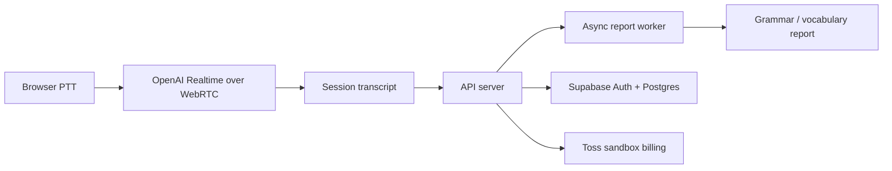

# LinguaCall

실시간 AI 회화 연습을 위한 WebRTC 기반 언어 학습 MVP입니다. 핵심은 “음성으로 대화한다”가 아니라, 실제 회화처럼 턴을 제어하고 대화 이후 학습 리포트까지 이어지는 제품 흐름을 검증하는 것이었습니다.

> Portfolio position: realtime AI product engineering, browser voice UX, launch-oriented backend/worker/deploy pipeline.

## Why This Problem

언어 시험 준비자는 실제 대화처럼 말하고 즉시 피드백을 받아야 합니다. 하지만 일반 채팅형 학습 도구는 음성 턴 제어, 실시간성, 교정 리포트, 단어 확인 흐름이 분리되어 있습니다. LinguaCall은 브라우저 음성 대화와 학습 리포트를 하나의 제품 흐름으로 묶는 문제를 풀기 위해 만들었습니다.

## Method



## What I Built

- Browser-direct OpenAI Realtime voice session over WebRTC
- Push-to-Talk 기반 음성 입력 제어
- Supabase Auth 기반 로그인과 bearer-token API auth
- Supabase Postgres 기반 세션/리포트 데이터 저장
- Toss sandbox billing path
- API process와 분리된 async report worker
- 문법 교정 highlight, 단어 dictionary popover, session delete UX
- VPS self-hosted deployment path: `web + api + worker + caddy`

## My Role

개인 프로젝트로 프론트엔드, 백엔드, 인증, worker, 배포 구조를 단독 설계하고 구현했습니다. 초기 SaaS-heavy 구조를 걷어내고, 한국 시장 MVP에 필요한 Supabase/Toss/VPS 중심 launch stack으로 단순화했습니다.

## Engineering Decisions

| Decision | Alternatives Considered | Why This Choice | Tradeoff |
| --- | --- | --- | --- |
| Browser direct WebRTC path | server relay, text-only chat | 실시간 음성 UX와 latency를 우선 | client session handling이 복잡해짐 |
| API/worker split | synchronous report generation | 대화 API가 리포트 생성 지연에 묶이지 않게 분리 | worker deploy/monitoring 필요 |
| Supabase launch stack | Clerk + custom DB, heavier SaaS bundle | auth/data를 빠르게 묶고 MVP 검증 속도 확보 | vendor-specific integration 발생 |
| VPS + Caddy | Vercel/Railway only | web/api/worker를 한 launch stack으로 통제 | 운영 책임 증가 |
| Scope cut | many integrations at once | Clerk, Stripe, Railway, Vercel, SMS vendors, Sentry를 active path에서 제거 | 관측/운영 자동화는 후속 과제로 남음 |

## AI-Assisted Engineering Record

| Task | How AI Was Used | My Review / Rejection | Verification |
| --- | --- | --- | --- |
| Realtime architecture | WebRTC session 후보와 API 역할 분리안을 비교하게 함 | server relay 방식은 latency/운영비 관점에서 MVP 우선순위에서 제외 | PTT session bootstrapping smoke |
| Worker split | report worker failure case와 retry/checkpoint 관점을 검토하게 함 | API process에 리포트 생성을 남기는 안은 응답 지연 위험 때문에 제외 | worker process separation, report flow check |
| Launch simplification | 사용 중인 SaaS 후보를 launch-critical/non-critical로 분류하게 함 | 많은 도구를 붙이는 대신 Supabase/Toss/VPS로 좁힘 | `pnpm launch:env:check`, `pnpm launch:smoke` |
| Documentation | README 초안을 problem/decision/evidence 구조로 재작성하게 함 | AI 문장은 그대로 두지 않고 설명 가능한 tradeoff 중심으로 수정 | README review and privacy scan |

## Stack

| Area | Stack |
| --- | --- |
| Frontend | React, TypeScript, Vite, Tailwind CSS |
| Realtime voice | WebRTC, OpenAI Realtime API |
| Backend | Node.js, TypeScript, API server, worker process |
| Auth/Data | Supabase Auth, Supabase Postgres |
| Deploy | Docker Compose, Caddy, VPS |
| Billing | Toss sandbox flow |

## Repository Map

```text
apps/       web, api, worker
packages/   shared packages
infra/      Docker/Caddy/deploy configuration
docs/       product and engineering notes
scripts/    launch smoke and validation scripts
```

## Run Locally

```bash
pnpm install
pnpm dev
```

Production-style checks and deployment helpers:

```bash
pnpm lint
pnpm typecheck
pnpm build
pnpm launch:env:check
pnpm launch:smoke
pnpm compose:config
```

Environment values are intentionally not committed. Use local `.env` / deployment secrets only.

## Validation Evidence

| Evidence | Result | Repro / Check |
| --- | --- | --- |
| Realtime voice path | Browser WebRTC session bootstrapping with PTT mode | PTT session smoke path |
| Auth | Supabase auth and refresh-session recovery path | bearer-token API auth check |
| Worker architecture | Report processing moved out of API process | worker process and report flow check |
| Learning UX | Grammar correction highlight and dictionary popover | UI interaction check |
| Deploy path | VPS Docker Compose stack with Caddy HTTPS | `pnpm compose:config` |
| Scope reduction | non-critical SaaS tools removed from active launch path | launch checklist review |

## Known Limits

- Public demo screenshots are not committed yet because product credentials and user data must stay private.
- Production monitoring and alerting are intentionally scoped after MVP validation.
- Billing is sandbox-oriented in this portfolio state.
- Realtime quality should be tested with more network conditions before production claims.

## Status

MVP launch path is ready for real-user testing and hardening. Remaining work is product iteration, monitoring, public demo capture, and production launch validation.
